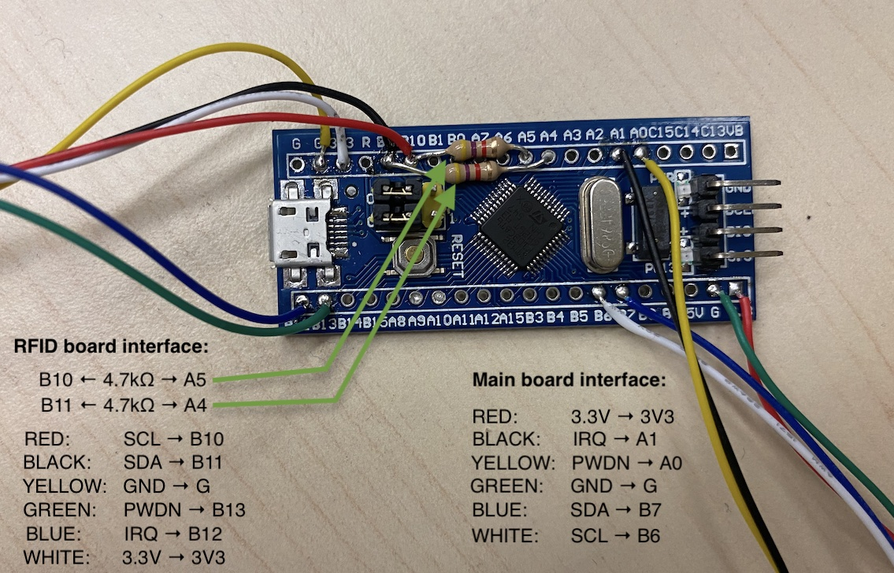
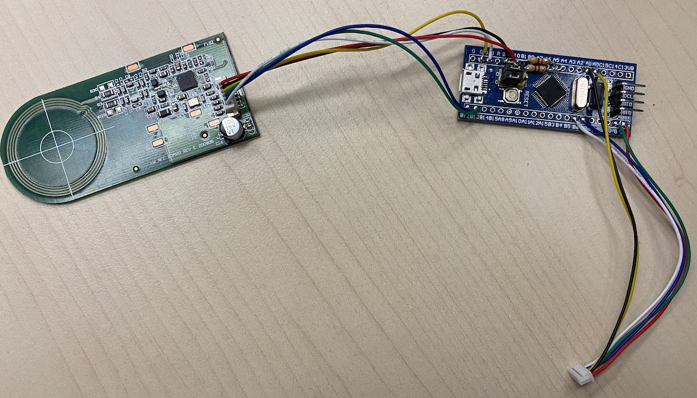
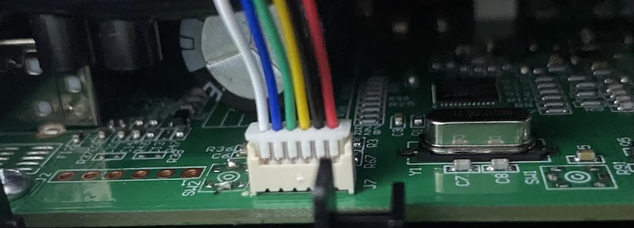
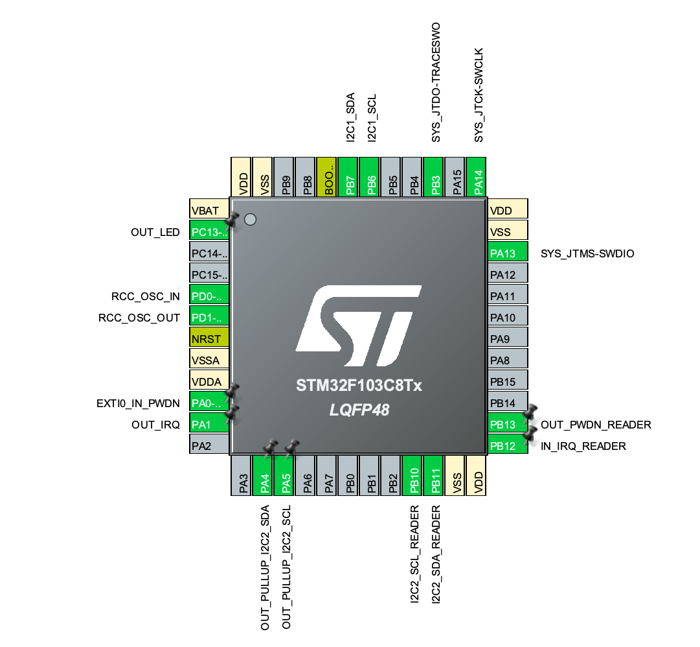

## FreeDMO

[](https://github.com/queengooborg/free-dmo-stm32/releases/latest) <== Klicke hier zum downloaden

**solltest du RFID-Tag-Daten kopiert haben für Etiketten, kannst du sie uns hier bereitstellen** (see: https://github.com/free-dmo/free-dmo-tag-dump).

## Installation

Diese Modifikation zu installieren, erfordert Grundkenntnisse in folgenden Bereichen: Löten, Mikroprozessoren, Elektronik. Die Installation erfolgt auf eigene Gefahr  

### benötigtes Werkzeug

- Schraubendrehler
- Lötstation/Lötkolben, Lötzinn
- Einer der beiden Adapter: ST-LINK V2 oder UART Adapter<br>
  (benötigt zum programmieren da dies nicht über den Micro-USB-Port erfolgen kann).

### weitere benötigte Sachen

- 1× D.MO 550-Serie Etikettendrucker<br />
  getestet auf: 550, 550 Turbo und 5XL.

- 1× STM32F103C8T6 bluepill<br/>
  sucht nach: `STM32F103 bluepill` / `STM32F103 bluepill with STLinkV2`<br/>
  stellt sicher dass eure Platine den folgenden Chip verbaut hat: STM32F103C**8**T6 und nicht: STM32F103C**6**T6.
  **ACHTUNG:** viele Händler verkaufen [gefälschte bluepills](https://github.com/keirf/greaseweazle/wiki/STM32-Fakes). Fälschungen funktionieren villeicht nicht.

- 1× 6-pin Molex PicoBlade Kabel<br/>
  sucht nach: `6 pin Molex PicoBlade 1.25 mm` / `6pin 1.25mm MX Wire To Board Connector` / `JST MX 6pin`<br />
  Ihr braucht zwei Kabel mit jeweils eine der genannten Stecker. Sollte euer Kabel zwei Stecker haben, schneidet es einfach in der Mitte auseinander.

- 2× `4.7kΩ` Wiederstand<br />
  OPTIONAL und wird nur benötigt wenn ich die Echten RFID-Tags scannen wollt.

### Zusammenbau

Zuerst nehmt ihr euer Kabel.  Solltest du ein Kit zum selbst crimpen haben, crimpt nun eure Stecker.


**→ Achtet auf die richtige Verdrahtung der Kabel.**<br/>
Die im Bild gezeigten rechten Kabel gehen zum Etiktettendrucker und die linken Kabel zur RFID-Platine wenn ihr diese verwenden wollt.

_Verbinden der RFID-Platine ist optional._ Wenn du nur ein einziges Label drucken willst und keine echten RFID-Chips nutzen willst, musst du auch keine Kabel für die RFID-Platine anlöten und auch keine Wiederstände.

STM32F103 blue pill:


Verbindung der RFID Platine:


Verbindung zum Drucker-Mainboard:


**Prüft die Verkabelung bevor ihr den Etikettendrucker mit Strom versorgt.**

### vorbereiten der Firmware

Es gibt zwei Wege die Firmware für den Bluepill vorzubereiten:

#### Nutzung einer fertigen Firmware

fertige und kompilierte Firmware gibt es hier: [Download](https://github.com/queengooborg/free-dmo-stm32/releases/latest)

Du kannst eine der bereits kompilierten Firmwares nutzen die bereits einen Standart-Tag definiert haben. (wird genutzt wenn kein Orginaler RFID-Tag vorhanden ist).

#### Source-Code kompilieren

um die Firmware vom Source-Code zu kompilieren, befolge folgende Schritte:

1. Installiere die erforderliche ARM-Toolchain
   - Debian Linux:
     - `sudo apt install gcc-arm-none-eabi libnewlib-arm-none-eabi`
   - Windows/macOS/Andere Linux:
     - https://developer.arm.com/downloads/-/gnu-rm
     - öffne die "Makefile" und editiere den Pfad in Zeile 1 `GCC_PATH` um auf den toolchain `bin` Ordner zu verweisen (z.B. `GCC_PATH = ../gcc-arm-none-eabi-10.3-2021.07/bin`)
2. führe folgenden Befehl aus: `make DMO_SKU={ausgewählte SKU zum kompilieren}` um die Firmware zu erstellen.

A `freedmo.bin` Datei wird im `build` Ordner erstellt.

### Installiere dir Firmware

1. Installiere [`STM32CubeProgrammer`](https://www.st.com/en/development-tools/stm32cubeprog.html) (falls du es noch nicht hast)
2. Setze den Bluepill in den Wartungsmodus [Boot Brücke von 0 auf 1 setzen auf der Platine](ASSEMBLY_PICTURES/dfu.jpg)
   - Nutzt du den ST-Link Adapter, ist das nicht zwingend benötigt. Aber es wird empfohlem um sicherzustellen dass keine Firmware während der Programmierung ausgeführt wird.
3. Verbinde den Bluepill mit einem Adapter mit dem Computer:
   - Einen ST-LINK V2 (SWD download)
     1. Connect all pins to their corresponding counterparts (3.3V to 3.3V, etc.) between the bluepill and ST-LINK
        - Note: "SWIO" and "SWDIO" are the same pin
     2. Connect the ST-LINK to your computer
        - If you haven't yet, it is highly recommended to update the ST-LINK's firmware to reduce potential issues
   - A UART adapter (serial download)
     1. From the UART adapter to the bluepill, [connect VCC to 5V, GND to GND, TX0 to A10, and RX1 to A9](https://www.electronicshub.org/wp-content/uploads/2020/02/Connections-for-Programming-STM32.jpg)
     2. Connect the UART adapter to your computer
4. Launch `STM32CubeProgrammer`
5. In the top-right corner, select the appropriate connection method (`ST-LINK` or `UART`)
   - If the ST-LINK is detected, its [serial number will appear in the appropriate field](ASSEMBLY_PICTURES/st-link-programming.png)
   - If you are using a UART adapter, you will need to [select the appropriate port](https://www.electronicshub.org/wp-content/uploads/2020/02/STM32CubeProgrammer-Config-1.jpg)
6. Click the `Connect` button in the top-right corner
7. Select the [`Erasing & Programming` tab](https://www.electronicshub.org/wp-content/uploads/2020/02/STM32CubeProgrammer-Config-2.jpg) on the left side
8. In the `File path` field, click `Browse` and select the desired firmware
   - Tip: make sure that the `Start address` is `0x08000000`
9. Click `Start Programming`
10. Once programming is complete, click `Disconnect` in the top-right corner and disconnect your programming module from both your computer and the bluepill
11. Switch your bluepill back to normal mode by [switching the BOOT0 jumper back to 0](ASSEMBLY_PICTURES/dfu.jpg)

Happy printing... 😈

## Usage

The bluepill will emulate the RFID tag of a D.MO label roll if an RFID tag is not already detected, including counting down the remaining labels. To reset the remaining label count, simply power cycle the printer.

## Troubleshooting

### I can't program the board with the Micro USB port, what do I do?

Unfortunately, you cannot program the Bluepill with its Micro USB port. You will have to use an ST-LINK v2 or a UART adapter.

### I've assembled my printer but it won't print because "unknown labels are loaded".

Double-check your connections between the Bluepill and the mainboard. You may have a loose connection which is preventing the Bluepill and mainboard from communicationg with each other. Additionally, check for solder bridges between the pins.

### I can't read real RFID tags, I can only emulate them.

Double-check your connections between the Bluepill and the RFID board. Also, make sure your two resistors are installed properly and their pins aren't touching.

Note: you should also double-check if you have an [authentic STM32F103 Bluepill](https://github.com/keirf/greaseweazle/wiki/STM32-Fakes).

## Technical info

### D.MO RFID tag emulation

After startup of the printer a default tag emulation is used which can be defined in the firmware.
The emulation will count down correctly until the end of the roll is reached. A power cycle / sleep+wakeup of the printer is enough to reset the emulated tag counter back to it's maximum.

If the original RFID board is also connected and a spool with D.MO RFID tag is found then the emulation data is updated with the data from this RFID tag. Just the counter will be emulated in this case. The tag that is detected and emulated upon powerup is the only label that will be recognized in the printer until another power cycle. This enables the use of any D.MO format unless you have at least one original spool (you can peel the RFID label of that role and attach it to the inside of the printer). If you change genuine labels (with RFID tag) then you will need to power cycle the printer to detect the new label.

**Please consider dumping this data and providing it here for others** (see: https://github.com/free-dmo/free-dmo-tag-dump).

D.MO uses it's own Originality Signature (own signing key) which is used to sign the UID of the tag.
This is used to only allow D.MO's own SLIX2 tags. However when you can emulate the UID you also can emulate the corresponding signature bytes, you just need to dump them from a valid tag.<br/>(see: https://github.com/free-dmo/free-dmo-tag-dump).

The firmware contains some D.MO SLIX2 tag dumps which you can choose from: <br/>
file: `Src/main.c`

```C
#define SLIX2_TAG_EMU 1
//#define SLIX2_TAG_EMU 2
//#define SLIX2_TAG_EMU 3
```

It does not matter which TAG_EMU you use. All of them will work for now. Maybe... in future D.MO will release new printer / firmware which might block those UIDs... but then we only need to dump a new spool of labels to get a new and valid UID+signature.

The data about the labels (SKU, size, count, ...) is encoded in the standard SLIX2 data blocks.
**Inside of this data is no dependency to the UID or signature**. This enables a "mix and match" of SLIX2 tag (UID+signature) and the media data used from the printer. Unfortunately the encoded data uses an unknown CRC32 algorithm which limits us to use existing dumped label formats only.

You can choose from the list of included label data by selecting the SKU: <br/>
file: `Src/main.c`

```C
#define DMO_SKU_S0722430 // 54 x 101 mm, 220 pcs.
//#define DMO_SKU_S0722550 // 19 x  51 mm, 500 pcs.
//#define DMO_SKU_S0722400 // 36 x  89 mm, 50 pcs.
```

### STM32CubeMx

The project comes with the CubeMX .ioc file which can be used to modify pins and/or change to different CPU types. The complete code is inside of ST's magic `BEGIN_USER_CODE` / `END_USER_CODE` markers so "Generate Code" in CubeMX can be used without any problems.

#### STM32F103 pin assignment


